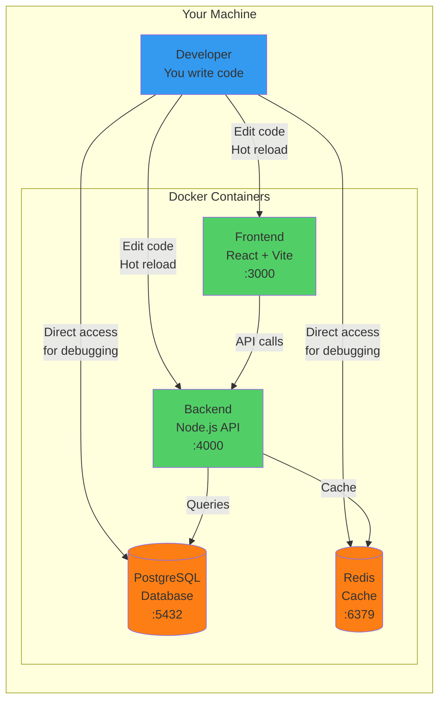

# Zero-to-Running Developer Environment

[](CHANGELOG.md)
[](LICENSE)

**One command to rule them all: `make dev`**

A Docker-based development environment that gets you from zero to a fully running multi-service application stack in under 10 minutes. No manual configuration, no version conflicts, no "works on my machine" problems.

---

## ❌ The Problem

Traditional developer environment setup is painful:

- **2-3 days** wasted installing PostgreSQL, Redis, Node.js with the right versions
- **Version conflicts**: One project needs PostgreSQL 14, another needs 15
- **"Works on my machine"** syndrome - everyone has slightly different configs  
- **Port collisions** and cryptic errors without context
- **No easy cleanup** - services pollute your machine
- **Senior engineer time wasted** helping with setup issues

**Result:** New developers spend their first week fighting infrastructure instead of coding.

---

## ✅ Our Solution: Docker-Based Zero-to-Running

**Time to productivity: Under 10 minutes**

| Approach | Version Control | Resource Usage | Startup Time | Isolation | Production Parity |
|----------|----------------|----------------|--------------|-----------|------------------|
| **Manual Install** | ❌ Inconsistent | ✅ Light | ⚠️ Varies | ❌ None | ❌ Poor |
| **Virtual Machines** | ✅ Good | ❌ Heavy (4-8GB) | ❌ 5-10 min | ✅ Complete | ⚠️ Moderate |
| **Version Managers** | ⚠️ Languages only | ✅ Light | ✅ Fast | ❌ Partial | ❌ Poor |
| **🎯 Docker (Our Choice)** | ✅ Perfect | ✅ Light | ✅ 1-2 min | ✅ Complete | ✅ Identical |

**Key Benefits:**
- ✅ **Version Consistency**: Everyone runs exact same PostgreSQL 15.2, Redis 7.0.5, Node 18.12
- ✅ **Complete Isolation**: Multiple projects, zero conflicts, no port collisions
- ✅ **Production Parity**: Same containers from dev → staging → prod
- ✅ **Clean Teardown**: `make clean` removes everything, no residue
- ✅ **Cross-Platform**: Works on Mac, Linux, Windows (WSL2)

---

## 🏗️ How It Works

### Service Architecture

The diagram below shows how all services run in isolated Docker containers on your machine. You edit code locally with hot reload, while services communicate seamlessly:



**How to read this diagram:**
- **Blue (Developer)**: That's you! You edit Frontend and Backend code directly on your machine
- **Green (App Services)**: Frontend and Backend run in containers with hot reload - changes appear instantly
- **Orange (Data Services)**: PostgreSQL and Redis run in containers with persistent data volumes
- **Arrows**: Show how services communicate (Frontend → Backend → Database/Cache)
- **Ports**: All services accessible on localhost (3000, 4000, 5432, 6379)

**What makes this powerful:**
1. Edit code in your IDE → Changes auto-reload in containers (1-2 seconds)
2. Need to debug database? `make shell-db` gives you instant PostgreSQL access
3. Working on a different project? No conflicts - each project has isolated containers
4. Done for the day? `make down` stops everything cleanly

---

## 📋 Prerequisites

- **Docker Desktop** 24.0+ installed and running
- **Git** installed
- **8GB RAM** minimum (16GB recommended)
- **20GB free disk space**
- **Internet connection** (for first-time image downloads)

---

## 🚀 Quick Start

```bash
# 1. Clone the repository
git clone <repository-url>
cd zero-to-running

# 2. Copy environment configuration
cp .env.example .env

# 3. Choose your setup based on your role
make list-families              # See all available options

# 4. Start your environment
make dev JOB_FAMILY=full-stack  # Full-stack developer (all services)
# OR
make dev JOB_FAMILY=backend-engineer    # Backend only
# OR
make dev JOB_FAMILY=frontend-engineer   # Frontend only
# OR
make dev JOB_FAMILY=ml-engineer         # ML/Data science
# OR
make dev                        # Default: full-stack
```

**Your services are now running!**
- **Frontend**: http://localhost:3000
- **Backend API**: http://localhost:4000
- **PostgreSQL**: localhost:5432 (when included in your job family)
- **Redis**: localhost:6379 (when included in your job family)

## 🎯 Choose Your Developer Setup

Pick what you need based on your role:

| Job Family | What You Get | Use Case |
|------------|--------------|----------|
| `full-stack` | PostgreSQL + Redis + Backend + Frontend | Full-stack web development |
| `backend-engineer` | PostgreSQL + Redis + Backend | Backend/API development |
| `frontend-engineer` | Backend + Frontend | Frontend development (backend for API calls) |
| `ml-engineer` | PostgreSQL + Redis + Jupyter + Python | Machine learning & data science |
| `data-engineer` | PostgreSQL + Redis + Jupyter | Data engineering & ETL |
| `api-developer` | PostgreSQL + Redis + Backend | REST/GraphQL API development |

**Fine-tune your setup:**
```bash
# Exclude specific services you don't need
make dev JOB_FAMILY=ml-engineer NO_REDIS=true
make dev JOB_FAMILY=full-stack NO_REDIS=true NO_FRONTEND=true
```

**Customize job families:**

Edit `config/job-families.yml` to create your own configurations or modify existing ones:
```yaml
job_families:
  your-custom-setup:
    components: [postgres, backend, redis]
    description: "Your custom combination"
```

Then use it: `make dev JOB_FAMILY=your-custom-setup`

## 💡 Day-to-Day Commands

### Starting & Stopping
```bash
make dev          # Start your environment (with your chosen job family)
make down         # Stop all services
make restart      # Restart everything
```

### Monitoring
```bash
make logs         # View all logs
make health       # Check if everything is running
make ps           # Show what's running
```

### Development
```bash
make shell-backend     # Jump into backend container
make shell-frontend    # Jump into frontend container
make shell-db          # Access PostgreSQL
```

### Database
```bash
make db-seed      # Add sample data for testing
make db-reset     # Reset database (careful!)
make db-backup    # Backup your data
```

### Testing
```bash
make test         # Run all tests
make lint         # Check code quality
make format       # Auto-format code
```

**Run `make help` to see all 55+ commands**

## 🔧 Configuration

### Environment Variables

Edit `.env` to customize:
```bash
# Database
POSTGRES_DB=wander_dev
POSTGRES_USER=wander_user
POSTGRES_PASSWORD=dev_password_change_in_prod

# Ports (change if you have conflicts)
FRONTEND_PORT=3000
BACKEND_PORT=4000
POSTGRES_PORT=5432
REDIS_PORT=6379

# Logging
LOG_LEVEL=debug         # debug, info, warn, error

# SSL (for OAuth, secure cookies, mobile testing)
ENABLE_SSL=false        # Set to true after running make generate-certs
```

### Environment Profiles

Switch between different environments:
```bash
make dev-dev          # Development (hot reload, debug logs, sample data)
make dev-staging      # Staging (production-like, minimal data)
make dev-prod         # Production-local (production config, no sample data)
```

See [PROFILES.md](docs/PROFILES.md) for details.

## 🏗️ What's Inside

### Core Services
- **PostgreSQL 15.2** - Production-ready relational database
  - Health checks and auto-restart
  - Data persistence across restarts
  - Sample data seeding for development
- **Redis 7.0.5** - High-performance caching
  - Password-protected
  - Persistence configured
  - Ready for session storage
- **Node.js/Express Backend** - RESTful API
  - Connected to PostgreSQL and Redis
  - Hot reload for instant changes
  - Structured logging with Winston
  - `/health` endpoint for monitoring
- **React/Vite Frontend** - Modern web UI
  - Hot module replacement (HMR)
  - Pre-configured API client
  - React Router for routing

### Developer Tools
- ✅ **Hot Reload** - Code changes reflect instantly
- ✅ **Pre-flight Checks** - Validates Docker, ports, environment before starting
- ✅ **Health Monitoring** - Automatic health checks for all services
- ✅ **Structured Logging** - Winston logger with correlation IDs
- ✅ **55+ Make Commands** - Everything at your fingertips
- ✅ **Pre-commit Hooks** - Auto-format and lint before commits
- ✅ **Testing Suite** - Jest, Vitest, Playwright ready to go

### Advanced Features
- ✅ **Environment Profiles** - Dev, staging, prod configurations
- ✅ **Job Family Config** - Install only what you need
- ✅ **SSL/HTTPS Support** - Local HTTPS for OAuth, secure cookies
- ✅ **Redis Caching** - Built-in caching middleware
- ✅ **Security Scanning** - Secret detection and vulnerability scanning
- ✅ **Database Seeding** - Sample data for testing (12 users, 25 products)

## 🔒 SSL/HTTPS

Enable HTTPS for OAuth flows, secure cookies, or mobile device testing:

```bash
# 1. Generate certificates
make generate-certs

# 2. Trust the certificate
make trust-cert

# 3. Enable in .env
echo "ENABLE_SSL=true" >> .env

# 4. Restart
make restart

# Access via HTTPS
# Frontend: https://localhost:3000
# Backend: https://localhost:4000
```

See [SSL_SETUP.md](docs/SSL_SETUP.md) for details.

## 🧪 Testing

```bash
# Run all tests
make test

# Run specific test suites
make test-backend      # Backend Jest tests
make test-frontend     # Frontend Vitest tests
make test-e2e         # End-to-end Playwright tests

# Watch mode
cd backend && npm run test:watch
cd frontend && npm run test:watch
```

See [TESTING.md](docs/TESTING.md) for writing tests.

## 🔐 Security

Built-in security features:
- Secret scanning on pre-commit
- Dependency vulnerability checks
- Docker security options (no-new-privileges)
- Environment variable validation

```bash
# Run security audit
make security-audit
```

See [SECURITY.md](docs/SECURITY.md) for best practices.

## 🚨 Troubleshooting

### Something Not Working?

```bash
# Run diagnostics
make pre-flight       # Check Docker, ports, environment
make health           # Check service health
make logs             # View logs
make troubleshoot     # Get help
```

### Common Issues

**Port Already in Use**
```bash
make check-ports      # See what's using your ports
# Kill the process or change ports in .env
```

**Docker Not Running**
```bash
make check-docker     # Verify Docker status
# Start Docker Desktop if needed
```

**Services Won't Start**
```bash
make logs             # Check for error messages
make clean && make dev  # Nuclear option: reset everything
```

**Can't Connect to Database**
```bash
make validate-env     # Check .env file
make shell-db         # Manually test connection
```

See [TROUBLESHOOTING.md](docs/TROUBLESHOOTING.md) for complete guide with 15+ common issues.

## 📊 Project Structure

```
zero-to-running/
├── backend/           # Node.js/Express API
│   ├── src/
│   │   ├── config/   # Database, Redis, Logger config
│   │   ├── routes/   # API endpoints
│   │   ├── middleware/ # Cache, logging, error handling
│   │   └── utils/    # Helper functions
│   └── tests/        # Jest tests
│
├── frontend/          # React/Vite app
│   ├── src/
│   │   ├── components/  # React components
│   │   ├── pages/       # Page components
│   │   └── services/    # API client
│   └── tests/           # Vitest tests
│
├── e2e/              # Playwright E2E tests
├── scripts/          # Utility scripts (pre-flight, SSL, etc.)
├── docs/             # All documentation
├── config/           # Job families configuration
└── docker-compose.yml  # Main orchestration file
```

## 📚 Documentation

All documentation is in the `docs/` directory:

**Getting Started:**
- [INSTALL_DOCKER.md](docs/INSTALL_DOCKER.md) - Docker installation

**Features:**
- [BACKEND_API.md](docs/BACKEND_API.md) - Backend API docs
- [FRONTEND.md](docs/FRONTEND.md) - Frontend development
- [DATABASE.md](docs/DATABASE.md) - Database usage
- [REDIS.md](docs/REDIS.md) - Redis configuration
- [LOGGING.md](docs/LOGGING.md) - Logging system

**Advanced:**
- [JOB_FAMILIES.md](docs/JOB_FAMILIES.md) - Job family configuration
- [PROFILES.md](docs/PROFILES.md) - Environment profiles
- [SSL_SETUP.md](docs/SSL_SETUP.md) - HTTPS setup
- [TESTING.md](docs/TESTING.md) - Testing guide
- [PERFORMANCE.md](docs/PERFORMANCE.md) - Optimization
- [ADVANCED_USAGE.md](docs/ADVANCED_USAGE.md) - Advanced commands

**Code Quality:**
- [CODE_QUALITY.md](docs/CODE_QUALITY.md) - Pre-commit hooks
- [SECURITY.md](docs/SECURITY.md) - Security practices

**Help:**
- [TROUBLESHOOTING.md](docs/TROUBLESHOOTING.md) - Troubleshooting guide
- [FAQ.md](docs/FAQ.md) - Frequently asked questions
- [COMMON_ERRORS.md](docs/COMMON_ERRORS.md) - Quick error reference
- [DEBUGGING.md](docs/DEBUGGING.md) - Debugging techniques

## 🛠️ Complete Command Reference

### Service Management
```bash
make dev                    # Start all services
make dev JOB_FAMILY=X       # Start with specific job family
make dev-dev/staging/prod   # Start with environment profile
make down                   # Stop all services
make restart                # Restart all services
make clean                  # Remove all data/volumes
```

### Monitoring
```bash
make logs                   # All logs (follow mode)
make logs-frontend          # Frontend logs only
make logs-backend           # Backend logs only
make logs-db                # Database logs only
make logs-redis             # Redis logs only
make logs-filter LEVEL=error     # Filter by log level
make logs-filter SERVICE=backend # Filter by service
make health                 # Check all service health
make ps                     # Show running containers
```

### Development
```bash
make shell-frontend         # Access frontend shell
make shell-backend          # Access backend shell
make shell-db               # Access PostgreSQL
make shell-redis            # Access redis-cli
```

### Database
```bash
make db-seed                # Seed with sample data
make db-reset               # Reset database
make db-backup              # Backup to backups/
make db-restore FILE=path   # Restore from backup
```

### Testing & Quality
```bash
make test                   # Run all tests
make test-backend           # Backend tests
make test-frontend          # Frontend tests
make test-e2e               # E2E tests
make lint                   # Lint all code
make lint-fix               # Auto-fix issues
make format                 # Format with Prettier
```

### Environment
```bash
make profile-switch PROFILE=X  # Switch profile
make profile-status            # Show current profile
make list-families             # List job families
make show-family JOB_FAMILY=X  # Show family components
```

### SSL/HTTPS
```bash
make generate-certs         # Generate SSL certificates
make trust-cert             # Trust certificate
```

### Security
```bash
make security-audit         # Run security checks
```

### Utilities
```bash
make check-docker           # Verify Docker
make validate-env           # Validate .env
make check-ports            # Check port availability
make pre-flight             # Run all checks
make troubleshoot           # Troubleshooting info
make help                   # Show all commands
```

### Docker Maintenance
```bash
make prune                  # Clean unused resources
make rebuild                # Rebuild all images
make rebuild-backend        # Rebuild backend only
make rebuild-frontend       # Rebuild frontend only
make update                 # Update dependencies
```

### Feedback
```bash
make feedback               # Submit feedback
make metrics-view           # View metrics
make metrics-clear          # Clear metrics
```

## 🎓 Code Quality & Commits

### Automatic Code Quality Checks

Pre-commit hooks automatically run:
- ESLint for code linting
- Prettier for code formatting
- Commitlint for commit message format

### Commit Message Format

Use [Conventional Commits](https://www.conventionalcommits.org/):

```bash
feat(backend): add user authentication
fix(frontend): resolve CORS error
docs: update README
test: add unit tests for auth
```

See [CODE_QUALITY.md](docs/CODE_QUALITY.md) for details.

## 📝 Contributing

1. Fork the repository
2. Create a feature branch: `git checkout -b feature/amazing-feature`
3. Make your changes
4. Commit with conventional commits: `git commit -m 'feat: add amazing feature'`
5. Push: `git push origin feature/amazing-feature`
6. Open a Pull Request

## 📄 License

MIT License - see [LICENSE](LICENSE) file for details.

## 🙏 Acknowledgments

- Docker and Docker Compose for containerization
- Node.js and Express for backend
- React and Vite for frontend
- PostgreSQL for database
- Redis for caching

## 📞 Support

- **Documentation**: `docs/` directory has everything
- **Quick Help**: Run `make troubleshoot`
- **FAQ**: See [FAQ.md](docs/FAQ.md)
- **Issues**: GitHub Issues

## 🎉 What You Get

**23 PRs, 100% Complete**

This is a production-ready development environment with:
- Complete full-stack application (database, cache, API, frontend)
- 55+ developer commands for everything you need
- Multiple environment profiles (dev, staging, prod)
- Job family configuration (only install what you need)
- Comprehensive testing setup (unit, integration, E2E)
- SSL/HTTPS support for production-like development
- Security hardening and vulnerability scanning
- Performance optimization with Redis caching
- Pre-commit hooks for code quality
- Complete documentation and troubleshooting guides

For technical details on implementation, see [PR_TASK_BREAKDOWN.md](PR_TASK_BREAKDOWN.md).

---

**Ready to code?** Run `make dev JOB_FAMILY=your-role` and start building! 🚀
